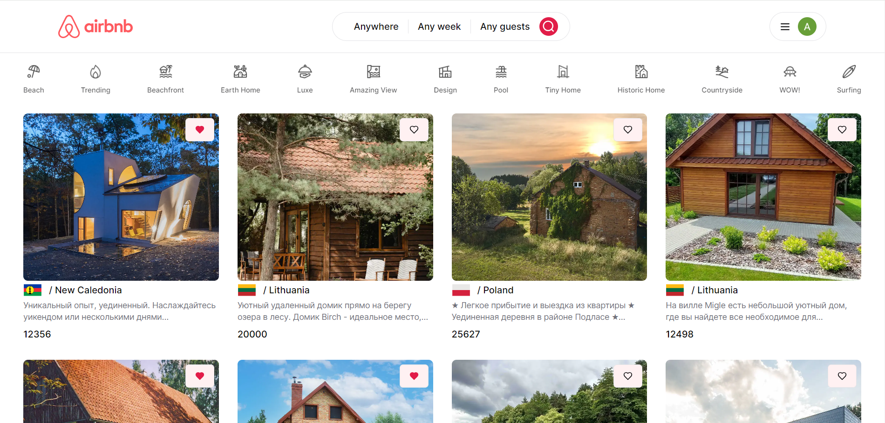
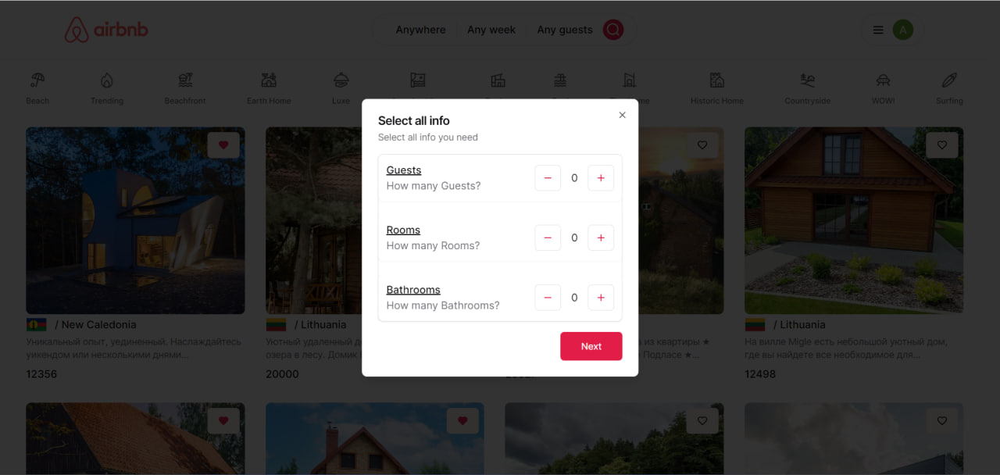
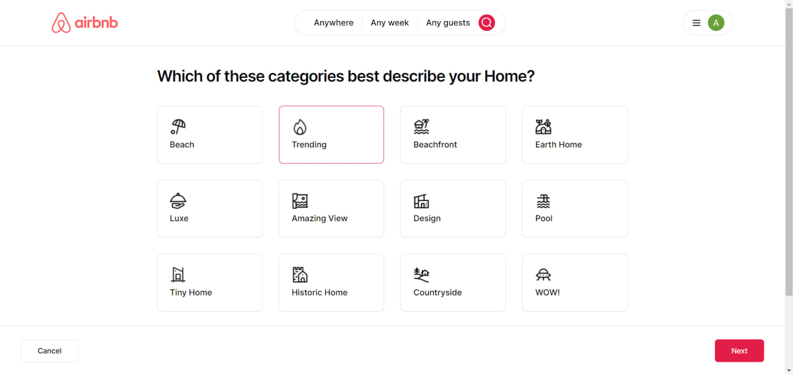
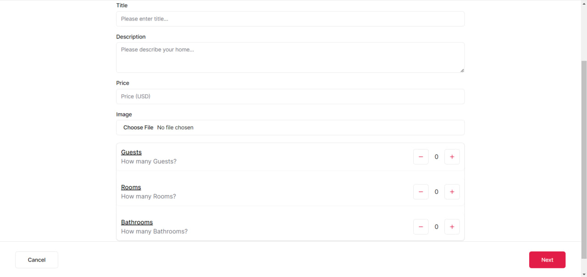
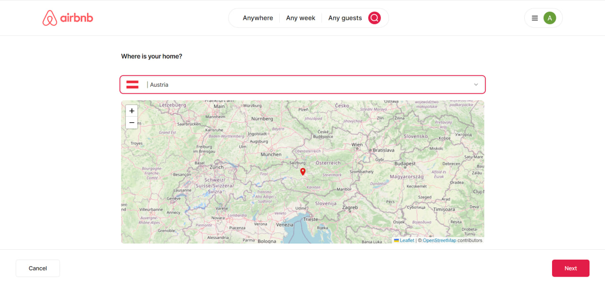
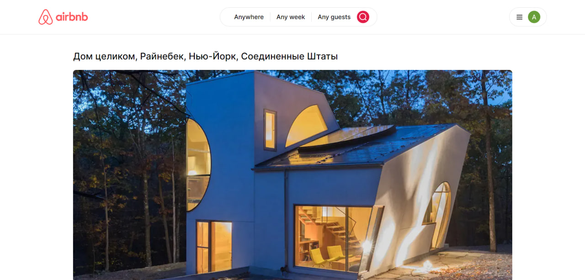
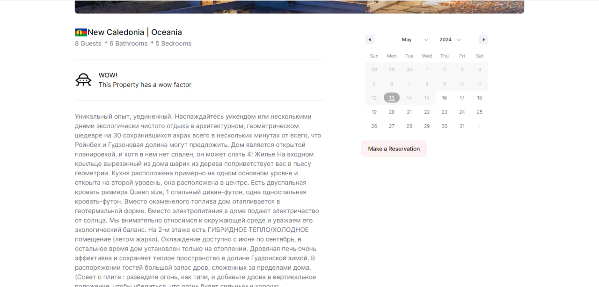
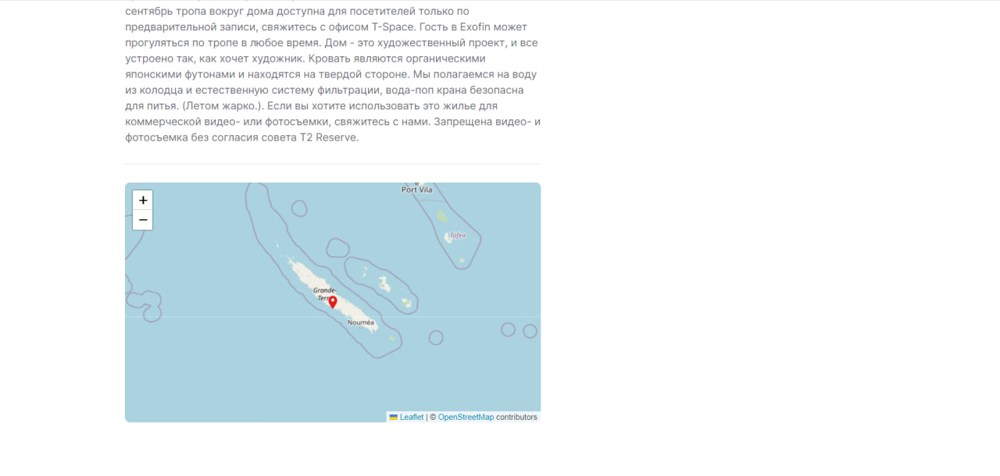
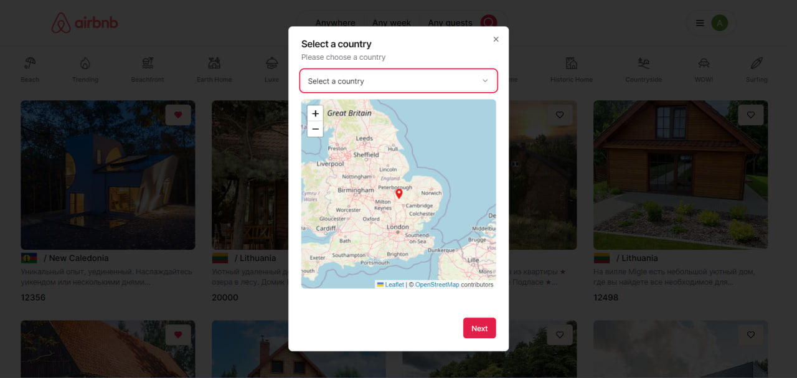
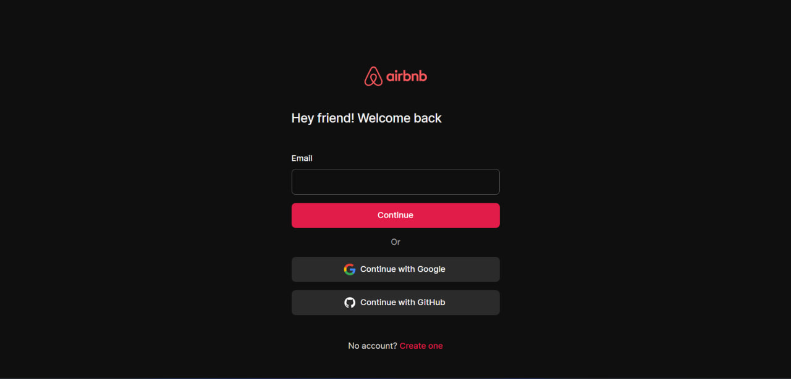

# Airbnb Clone with Next.js 14, Kinde, Supabase, Prisma, Tailwind and Shadcn/UI

### This is a Next.js project bootstrapped with `create-next-app`.

### Resources used:

- `Next.js`: https://nextjs.org
- `Kinde`: https://dub.sh/xeU8r3v
- `Tailwind.css`: https://tailwindcss.com
- `Shadcn/UI`: https://ui.shadcn.com
- `Prisma`: https://prisma.io
- `Supabase`: https://supabase.com
- `React-date-range`: https://www.npmjs.com/package/react-date-range

### Features:
 - `Next.js`
 - `Kinde Authentication`
 - `OAuth (Google and Github)`
 - `Supabase Database`
 - `Supabase Storage`
 - `Prisma ORM`
 - `Styling with Tailwindcss and shadcn UI`

### There are some screens:











## Getting Started
```
npm run dev
# or
yarn dev
# or
pnpm dev
# or
bun dev
```